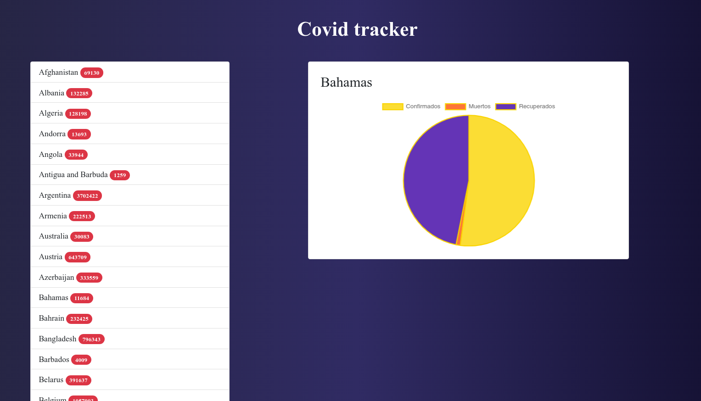

# Covid tracker 🐤

    

 
 
 

## Description

Esto es util para aprender a utilizar la libreria [chartjs](https://www.chartjs.org/)

## References

- [chartjs](https://www.chartjs.org/)
- [django chart js](https://github.com/peopledoc/django-chartjs)

     <h1>Happy code 🤭</h1>

